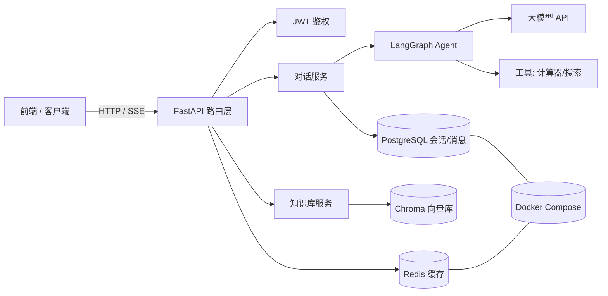
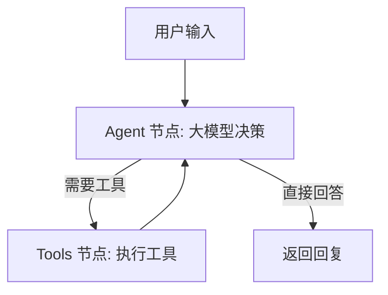

# 🤖 fastapi-langgraph-agent-backend

基于 **FastAPI + LangGraph** 的 AI Agent 后端服务。支持多轮对话、工具调用、RAG 知识库问答与流式输出（SSE），可一键 Docker 部署。

> 本项目为学习 / 面试作品，覆盖现代 AI 后端核心能力：FastAPI 异步服务、LangChain/LangGraph Agent 编排、PostgreSQL 持久化、Redis 缓存、RAG 检索增强生成。

**🌐 简体中文 | [English](./README_EN.md)**

---

## ✨ 功能特性

- 🔐 **JWT 用户认证**：注册 / 登录 / 获取当前用户
- 💬 **多轮对话**：基于 LangGraph 的 Agent 工作流，自动维护对话历史
- 🛠️ **工具调用**：内置计算器、网络搜索工具，模型可自主调用（ReAct 范式）
- ⚡ **流式输出**：SSE 逐 token 返回，前端实时渲染
- 📚 **RAG 知识库**：上传 PDF / Word / Markdown / TXT，自动切分 + 向量化 + 语义检索
- 🗄️ **PostgreSQL + Redis**：关系型持久化 + 缓存/限流
- 🐳 **Docker Compose 一键部署**

---

## 🧱 技术栈

| 分类 | 技术 |
|------|------|
| Web 框架 | FastAPI（异步、自动 Swagger 文档） |
| Agent 编排 | LangChain + LangGraph |
| 数据库 | PostgreSQL 16（SQLAlchemy 2.0 ORM） |
| 缓存 | Redis 7 |
| 认证 | python-jose (JWT) + passlib (bcrypt) |
| 向量库 | Chroma（本地持久化） |
| 嵌入/对话 | OpenAI / DeepSeek / 通义千问 兼容接口 |
| 部署 | Docker + Docker Compose |
| 测试 | pytest |

---

## 📐 架构图



**Agent 工作流（LangGraph）：**



---

## 🚀 快速开始

### 方式一：Docker Compose（推荐）

```bash
# 1. 准备环境变量
cp .env.example .env
# 编辑 .env，至少填入 OPENAI_API_KEY（或兼容接口的 BASE_URL + KEY）

# 2. 一键启动（PostgreSQL + Redis + 后端）
docker compose up --build

# 3. 访问
# API 文档:   http://localhost:8000/docs
# 前端界面:   把 frontend/index.html 用浏览器打开（或放到任意静态服务器）
```

### 方式二：本地运行

```bash
# 1. 安装依赖（建议使用虚拟环境）
pip install -r requirements.txt

# 2. 启动本地 PostgreSQL 与 Redis（或用 Docker）
# 3. 配置 .env（DATABASE_URL / REDIS_URL / OPENAI_API_KEY）
cp .env.example .env

# 4. 启动服务
uvicorn app.main:app --reload --port 8000
```

---

## 📡 API 一览

> 完整交互式文档见 `http://localhost:8000/docs`（Swagger UI）。

| 方法 | 路径 | 说明 |
|------|------|------|
| POST | `/api/v1/auth/register` | 注册 |
| POST | `/api/v1/auth/login` | 登录获取 JWT |
| GET  | `/api/v1/auth/me` | 当前用户 |
| POST | `/api/v1/conversations` | 新建会话 |
| GET  | `/api/v1/conversations` | 会话列表 |
| GET  | `/api/v1/conversations/{id}/messages` | 会话消息 |
| POST | `/api/v1/chat` | 非流式对话 |
| POST | `/api/v1/chat/stream` | 流式对话（SSE） |
| POST | `/api/v1/knowledge/upload` | 上传知识库文档 |
| POST | `/api/v1/knowledge/ask` | 知识库检索 |
| GET  | `/api/v1/health` | 健康检查 |

**调用示例：**

```bash
# 注册
curl -X POST http://localhost:8000/api/v1/auth/register \
  -H "Content-Type: application/json" \
  -d '{"username":"alice","email":"alice@example.com","password":"secret123"}'

# 登录
TOKEN=$(curl -X POST http://localhost:8000/api/v1/auth/login \
  -d "username=alice&password=secret123" | python -c "import sys,json;print(json.load(sys.stdin)['access_token'])")

# 对话
curl -X POST http://localhost:8000/api/v1/chat \
  -H "Authorization: Bearer $TOKEN" \
  -H "Content-Type: application/json" \
  -d '{"message":"1+2 等于几？"}'
```

---

## 📁 目录结构

```
fastapi-langgraph-agent-backend/
├── app/
│   ├── main.py              # FastAPI 入口
│   ├── config.py            # 配置
│   ├── database.py          # 数据库引擎
│   ├── dependencies.py      # 依赖注入（当前用户）
│   ├── models/              # ORM 模型
│   ├── schemas/             # Pydantic 模型
│   ├── routers/             # API 路由
│   ├── services/            # 业务逻辑
│   │   ├── agent/           # LangGraph Agent
│   │   ├── chat_service.py
│   │   └── knowledge_service.py
│   └── utils/               # 安全 / 缓存工具
├── frontend/index.html      # 简易聊天前端
├── docker/                  # Dockerfile
├── tests/                   # pytest 测试
├── docker-compose.yml
├── requirements.txt
└── README.md
```

---

## 🧠 学习收获

- 用 **FastAPI** 构建异步 REST API，理解依赖注入、Pydantic 校验、中间件
- 用 **LangGraph** 编排 Agent：state / node / conditional edge 的图编程思想
- 实现 **RAG**：文档解析 → 切分 → 向量化 → 相似度检索 → 注入 prompt
- 用 **PostgreSQL + Redis** 做数据持久化与缓存
- 用 **Docker Compose** 实现可复现的一键部署

---

## ⚠️ 安全说明

- `.env` 含密钥，**已被 .gitignore 忽略，请勿提交**
- 生产环境请修改 `SECRET_KEY`
- `calculator` 工具已做字符白名单校验，禁用任意代码执行

## 📄 License

MIT
