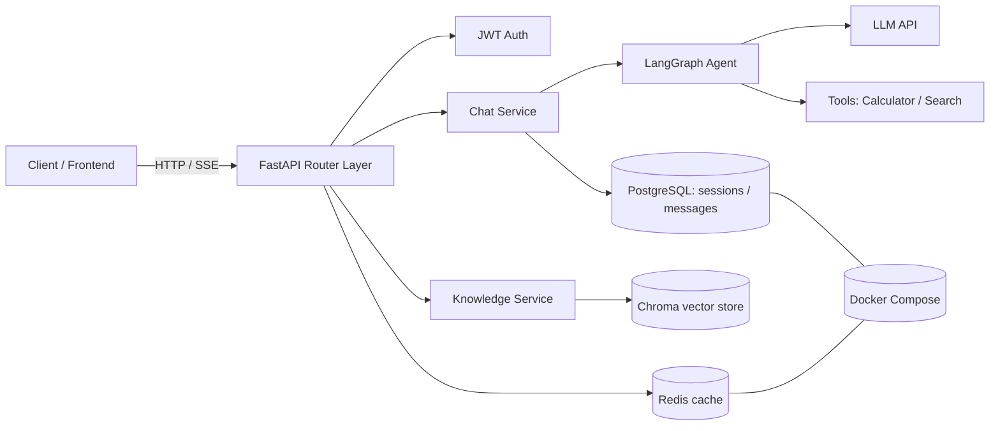
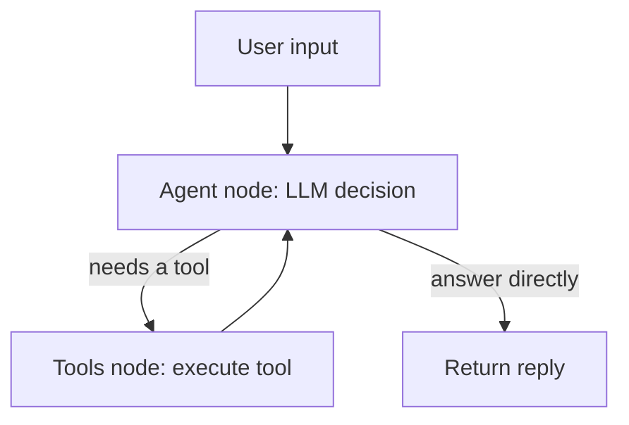

# 🤖 fastapi-langgraph-agent-backend

An AI Agent backend built on **FastAPI + LangGraph**. Supports multi-turn conversation, tool calling, RAG knowledge-base QA, and streaming output (SSE), deployable with a single Docker command.

**🌐 [简体中文](./README.md) | English**

> A learning / portfolio project covering the core capabilities of a modern AI backend: async FastAPI services, LangChain/LangGraph agent orchestration, PostgreSQL persistence, Redis caching, and retrieval-augmented generation.

---

## ✨ Features

- 🔐 **JWT authentication**: register / login / get current user
- 💬 **Multi-turn conversation**: LangGraph agent workflow that maintains conversation history automatically
- 🛠️ **Tool calling**: built-in calculator and web search tools that the model can invoke on its own (ReAct pattern)
- ⚡ **Streaming output**: SSE returns token by token for real-time frontend rendering
- 📚 **RAG knowledge base**: upload PDF / Word / Markdown / TXT, then auto-chunk, embed, and semantically retrieve
- 🗄️ **PostgreSQL + Redis**: relational persistence plus caching / rate limiting
- 🐳 **One-command Docker Compose deployment**

---

## 🧱 Tech Stack

| Category | Technology |
|------|------|
| Web framework | FastAPI (async, auto-generated Swagger docs) |
| Agent orchestration | LangChain + LangGraph |
| Database | PostgreSQL 16 (SQLAlchemy 2.0 ORM) |
| Cache | Redis 7 |
| Auth | python-jose (JWT) + passlib (bcrypt) |
| Vector store | Chroma (local persistence) |
| Embeddings / chat | OpenAI / DeepSeek / Qwen-compatible APIs |
| Deployment | Docker + Docker Compose |
| Testing | pytest |

---

## 📐 Architecture



**Agent workflow (LangGraph):**



---

## 🚀 Quick Start

### Option 1: Docker Compose (recommended)

```bash
# 1. Prepare the environment file
cp .env.example .env
# Edit .env and fill in at least OPENAI_API_KEY (or a compatible BASE_URL + KEY)

# 2. Start everything (PostgreSQL + Redis + backend)
docker compose up --build

# 3. Access
# API docs:   http://localhost:8000/docs
# Frontend:   http://localhost:8000/app/ (served by FastAPI on the same origin)
```

### Option 2: Run locally

```bash
# 1. Install dependencies (a virtual environment is recommended)
pip install -r requirements.txt

# 2. Start local PostgreSQL and Redis (or use Docker)
# 3. Configure .env (DATABASE_URL / REDIS_URL / OPENAI_API_KEY)
cp .env.example .env

# 4. Start the service
uvicorn app.main:app --reload --port 8000
```

---

## 📡 API Overview

> Full interactive docs at `http://localhost:8000/docs` (Swagger UI).

| Method | Path | Description |
|------|------|------|
| POST | `/api/v1/auth/register` | Register |
| POST | `/api/v1/auth/login` | Log in and get a JWT |
| GET  | `/api/v1/auth/me` | Current user |
| POST | `/api/v1/conversations` | Create a conversation |
| GET  | `/api/v1/conversations` | List conversations |
| GET  | `/api/v1/conversations/{id}/messages` | Messages in a conversation |
| POST | `/api/v1/chat` | Non-streaming chat |
| POST | `/api/v1/chat/stream` | Streaming chat (SSE) |
| POST | `/api/v1/knowledge/upload` | Upload a knowledge-base document |
| POST | `/api/v1/knowledge/ask` | Query the knowledge base |
| GET  | `/api/v1/health` | Health check |

**Example calls:**

```bash
# Register
curl -X POST http://localhost:8000/api/v1/auth/register \
  -H "Content-Type: application/json" \
  -d '{"username":"alice","email":"alice@example.com","password":"secret123"}'

# Log in
TOKEN=$(curl -X POST http://localhost:8000/api/v1/auth/login \
  -d "username=alice&password=secret123" | python -c "import sys,json;print(json.load(sys.stdin)['access_token'])")

# Chat
curl -X POST http://localhost:8000/api/v1/chat \
  -H "Authorization: Bearer $TOKEN" \
  -H "Content-Type: application/json" \
  -d '{"message":"What is 1+2?"}'
```

---

## 📁 Project Structure

```
fastapi-langgraph-agent-backend/
├── app/
│   ├── main.py              # FastAPI entrypoint
│   ├── config.py            # Configuration
│   ├── database.py          # Database engine
│   ├── dependencies.py      # Dependency injection (current user)
│   ├── models/              # ORM models
│   ├── schemas/             # Pydantic models
│   ├── routers/             # API routers
│   ├── services/            # Business logic
│   │   ├── agent/           # LangGraph agent
│   │   ├── chat_service.py
│   │   └── knowledge_service.py
│   └── utils/               # Security / cache helpers
├── frontend/index.html      # Minimal chat frontend
├── docker/                  # Dockerfile
├── tests/                   # pytest tests
├── docker-compose.yml
├── requirements.txt
└── README.md
```

---

## 🧠 What I Learned

- Building async REST APIs with **FastAPI**: dependency injection, Pydantic validation, middleware
- Orchestrating agents with **LangGraph**: the graph-programming model of state / node / conditional edge
- Implementing **RAG**: parse -> chunk -> embed -> similarity search -> prompt injection
- Persistence and caching with **PostgreSQL + Redis**
- Reproducible one-command deployment with **Docker Compose**

---

## ⚠️ Security Notes

- `.env` holds secrets, **is already git-ignored — do not commit it**
- Change `SECRET_KEY` before running in production
- The `calculator` tool uses a character allowlist; arbitrary code execution is disabled

## 📄 License

MIT
